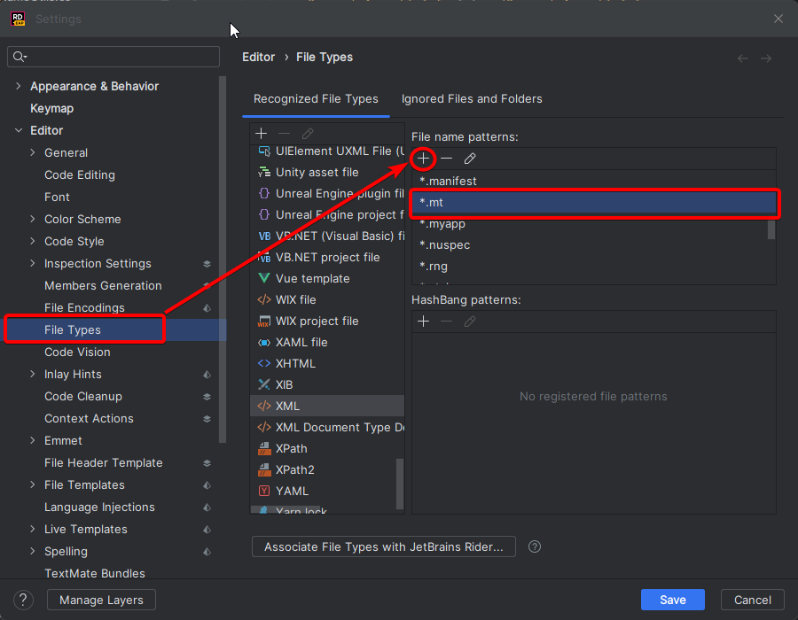

# Introduction to Manialinks in EvoSC

In Trackmania manialinks is a way to design and display interactive user interfaces in the game. Most of the game actually uses manialinks to display the UI. For example the menu, the editor, UI on servers etc.

Servers have ability to send manialinks to clients to show and hide UI for the players. Most server controllers use this functionality as a way to greatly improve the user experience for dedicated servers.

Manialinks is an important part in creating a good and user-friendly experience for players that make use of the controller's features.

EvoSC provides a complete framework for display and interaction with manialinks.

## Syntax highlighting
### Rider
Open Rider settings `File -> Settings` and then go to `Editor -> File Types`.

Under *Recognized File Types* find the `XML` file type.

Click the + symbol under *File name patterns:* and enter `.mt`. Click Ok and Save the settings.

